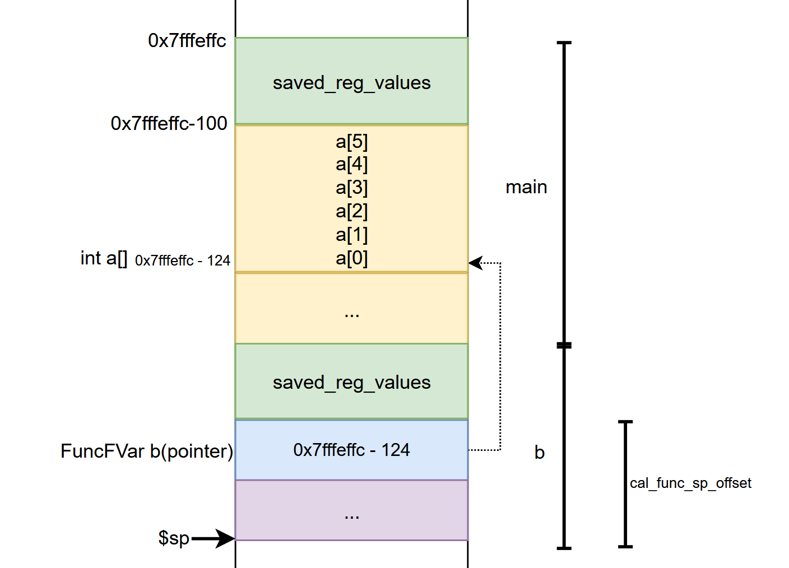

# 编译器设计文档

> BUAA 2021[秋]编译原理课程设计，实现Sys语言(C语言的子集)到`MIPS32`汇编代码的编译工作。

[toc]


## 写在前面

> 莫听穿林打叶声，何妨吟啸且徐行。竹杖芒鞋轻胜马，谁怕？*一蓑烟雨任平生*。
> 料峭春风吹酒醒，微冷，山头斜照却相迎。回首向来萧瑟处，归去，也无风雨也无晴。
>
> ​																																								——苏轼

此词与自己编写自己的编译器的过程何其相似。"穿林打叶声"是开课之前学长对课程描述，是杨老师PPT中往届同学留下的感想；"竹杖芒鞋"是自己可怜的编程能力；"任平生"是自己一路摸鱼，经过CO、OS、OO的洗礼依然站着；"料峭春风"是自己摸过错误处理，发现代码生成作业一步直达汇编；"微冷"是自己从中间代码到汇编蒙头直写却无法获得反馈的茫然；"山头斜照"是终于跑通编译器和优化时的胜利曙光；到写下这篇文档，"回首向来萧瑟处"时，曾经的坎坷都已"归去"，一切又回归平淡。


## 词法分析

### Pre. 添加整型编码和分支归属

Sys语言的词法分析类别码定义如下(增加整型编码)：

<div>
  <table style="border-collapse:collapse;" width="70%">
 <tbody>
  <tr height="10px">
   <td valign="center" style="font-weight:700;font-size: 11px;width:3271px;text-align:center;color:#000000;border-top:solid #d0d7e5 1px;border-right:solid #d0d7e5 1px;border-bottom:solid #d0d7e5 1px;border-left:solid #d0d7e5 1px;">单词名称</td>
   <td valign="center" style="font-weight:700;font-size: 11px;width:4302px;text-align:center;color:#000000;border-top:solid #d0d7e5 1px;border-right:solid #d0d7e5 1px;border-bottom:solid #d0d7e5 1px;border-left:solid #d0d7e5 1px;">类别码</td>
   <td valign="center" style="font-weight:700;font-size: 11px;width:2104px;text-align:center;color:#000000;border-top:solid #d0d7e5 1px;border-right:solid #d0d7e5 1px;border-bottom:solid #d0d7e5 1px;border-left:solid #d0d7e5 1px;">编码</td>
   <td valign="center" style="font-weight:700;font-size: 11px;width:2908px;text-align:center;color:#000000;border-top:solid #d0d7e5 1px;border-right:solid #d0d7e5 1px;border-bottom:solid #d0d7e5 1px;border-left:solid #d0d7e5 1px;">所属分析层</td>
  </tr>
  <tr height="10px">
   <td valign="center" style="font-weight:400;font-size: 11px;width:3871px;text-align:center;color:#000000;border-top:solid #d0d7e5 1px;border-right:solid #d0d7e5 1px;border-bottom:solid #d0d7e5 1px;border-left:solid #d0d7e5 1px;">Ident</td>
   <td valign="center" style="font-weight:400;font-size: 11px;width:4302px;text-align:center;color:#000000;border-top:solid #d0d7e5 1px;border-right:solid #d0d7e5 1px;border-bottom:solid #d0d7e5 1px;border-left:solid #d0d7e5 1px;">IDENFR</td>
   <td valign="center" style="font-weight:400;font-size: 11px;width:2104px;text-align:center;color:#000000;border-top:solid #d0d7e5 1px;border-right:solid #d0d7e5 1px;border-bottom:solid #d0d7e5 1px;border-left:solid #d0d7e5 1px;">0</td>
   <td rowspan="13" colspan="1" valign="center" style="font-weight:400;font-size: 11px;width:2908px;text-align:center;color:#000000;border-top:solid #d0d7e5 1px;border-right:solid #d0d7e5 1px;border-bottom:solid #d0d7e5 1px;border-left:solid #d0d7e5 1px;">words</td>
  </tr>
  <tr height="10px">
   <td valign="center" style="font-weight:400;font-size: 11px;width:3871px;text-align:center;color:#000000;border-top:solid #d0d7e5 1px;border-right:solid #d0d7e5 1px;border-bottom:solid #d0d7e5 1px;border-left:solid #d0d7e5 1px;">main</td>
   <td valign="center" style="font-weight:400;font-size: 11px;width:4302px;text-align:center;color:#000000;border-top:solid #d0d7e5 1px;border-right:solid #d0d7e5 1px;border-bottom:solid #d0d7e5 1px;border-left:solid #d0d7e5 1px;">MAINTK</td>
   <td valign="center" style="font-weight:400;font-size: 11px;width:2104px;text-align:center;color:#000000;border-top:solid #d0d7e5 1px;border-right:solid #d0d7e5 1px;border-bottom:solid #d0d7e5 1px;border-left:solid #d0d7e5 1px;">1</td>
  </tr>
  <tr height="10px">
   <td valign="center" style="font-weight:400;font-size: 11px;width:3871px;text-align:center;color:#000000;border-top:solid #d0d7e5 1px;border-right:solid #d0d7e5 1px;border-bottom:solid #d0d7e5 1px;border-left:solid #d0d7e5 1px;">const</td>
   <td valign="center" style="font-weight:400;font-size: 11px;width:4302px;text-align:center;color:#000000;border-top:solid #d0d7e5 1px;border-right:solid #d0d7e5 1px;border-bottom:solid #d0d7e5 1px;border-left:solid #d0d7e5 1px;">CONSTTK</td>
   <td valign="center" style="font-weight:400;font-size: 11px;width:2104px;text-align:center;color:#000000;border-top:solid #d0d7e5 1px;border-right:solid #d0d7e5 1px;border-bottom:solid #d0d7e5 1px;border-left:solid #d0d7e5 1px;">2</td>
  </tr>
  <tr height="10px">
   <td valign="center" style="font-weight:400;font-size: 11px;width:3871px;text-align:center;color:#000000;border-top:solid #d0d7e5 1px;border-right:solid #d0d7e5 1px;border-bottom:solid #d0d7e5 1px;border-left:solid #d0d7e5 1px;">int</td>
   <td valign="center" style="font-weight:400;font-size: 11px;width:4302px;text-align:center;color:#000000;border-top:solid #d0d7e5 1px;border-right:solid #d0d7e5 1px;border-bottom:solid #d0d7e5 1px;border-left:solid #d0d7e5 1px;">INTTK</td>
   <td valign="center" style="font-weight:400;font-size: 11px;width:2104px;text-align:center;color:#000000;border-top:solid #d0d7e5 1px;border-right:solid #d0d7e5 1px;border-bottom:solid #d0d7e5 1px;border-left:solid #d0d7e5 1px;">3</td>
  </tr>
  <tr height="10px">
   <td valign="center" style="font-weight:400;font-size: 11px;width:3871px;text-align:center;color:#000000;border-top:solid #d0d7e5 1px;border-right:solid #d0d7e5 1px;border-bottom:solid #d0d7e5 1px;border-left:solid #d0d7e5 1px;">break</td>
   <td valign="center" style="font-weight:400;font-size: 11px;width:4302px;text-align:center;color:#000000;border-top:solid #d0d7e5 1px;border-right:solid #d0d7e5 1px;border-bottom:solid #d0d7e5 1px;border-left:solid #d0d7e5 1px;">BREAKTK</td>
   <td valign="center" style="font-weight:400;font-size: 11px;width:2104px;text-align:center;color:#000000;border-top:solid #d0d7e5 1px;border-right:solid #d0d7e5 1px;border-bottom:solid #d0d7e5 1px;border-left:solid #d0d7e5 1px;">4</td>
  </tr>
  <tr height="10px">
   <td valign="center" style="font-weight:400;font-size: 11px;width:3871px;text-align:center;color:#000000;border-top:solid #d0d7e5 1px;border-right:solid #d0d7e5 1px;border-bottom:solid #d0d7e5 1px;border-left:solid #d0d7e5 1px;">continue</td>
   <td valign="center" style="font-weight:400;font-size: 11px;width:4302px;text-align:center;color:#000000;border-top:solid #d0d7e5 1px;border-right:solid #d0d7e5 1px;border-bottom:solid #d0d7e5 1px;border-left:solid #d0d7e5 1px;">CONTINUETK</td>
   <td valign="center" style="font-weight:400;font-size: 11px;width:2104px;text-align:center;color:#000000;border-top:solid #d0d7e5 1px;border-right:solid #d0d7e5 1px;border-bottom:solid #d0d7e5 1px;border-left:solid #d0d7e5 1px;">5</td>
  </tr>
  <tr height="10px">
   <td valign="center" style="font-weight:400;font-size: 11px;width:3871px;text-align:center;color:#000000;border-top:solid #d0d7e5 1px;border-right:solid #d0d7e5 1px;border-bottom:solid #d0d7e5 1px;border-left:solid #d0d7e5 1px;">if</td>
   <td valign="center" style="font-weight:400;font-size: 11px;width:4302px;text-align:center;color:#000000;border-top:solid #d0d7e5 1px;border-right:solid #d0d7e5 1px;border-bottom:solid #d0d7e5 1px;border-left:solid #d0d7e5 1px;">IFTK</td>
   <td valign="center" style="font-weight:400;font-size: 11px;width:2104px;text-align:center;color:#000000;border-top:solid #d0d7e5 1px;border-right:solid #d0d7e5 1px;border-bottom:solid #d0d7e5 1px;border-left:solid #d0d7e5 1px;">6</td>
  </tr>
  <tr height="15.0px">
   <td valign="center" style="font-weight:400;font-size: 11px;width:3871px;text-align:center;color:#000000;border-top:solid #d0d7e5 1px;border-right:solid #d0d7e5 1px;border-bottom:solid #d0d7e5 1px;border-left:solid #d0d7e5 1px;">else</td>
   <td valign="center" style="font-weight:400;font-size: 11px;width:4302px;text-align:center;color:#000000;border-top:solid #d0d7e5 1px;border-right:solid #d0d7e5 1px;border-bottom:solid #d0d7e5 1px;border-left:solid #d0d7e5 1px;">ELSETK</td>
   <td valign="center" style="font-weight:400;font-size: 11px;width:2104px;text-align:center;color:#000000;border-top:solid #d0d7e5 1px;border-right:solid #d0d7e5 1px;border-bottom:solid #d0d7e5 1px;border-left:solid #d0d7e5 1px;">7</td>
  </tr>
  <tr height="10px">
   <td valign="center" style="font-weight:400;font-size: 11px;width:3871px;text-align:center;color:#000000;border-top:solid #d0d7e5 1px;border-right:solid #d0d7e5 1px;border-bottom:solid #d0d7e5 1px;border-left:solid #d0d7e5 1px;">while</td>
   <td valign="center" style="font-weight:400;font-size: 11px;width:4302px;text-align:center;color:#000000;border-top:solid #d0d7e5 1px;border-right:solid #d0d7e5 1px;border-bottom:solid #d0d7e5 1px;border-left:solid #d0d7e5 1px;">WHILETK</td>
   <td valign="center" style="font-weight:400;font-size: 11px;width:2104px;text-align:center;color:#000000;border-top:solid #d0d7e5 1px;border-right:solid #d0d7e5 1px;border-bottom:solid #d0d7e5 1px;border-left:solid #d0d7e5 1px;">8</td>
  </tr>
  <tr height="10px">
   <td valign="center" style="font-weight:400;font-size: 11px;width:3871px;text-align:center;color:#000000;border-top:solid #d0d7e5 1px;border-right:solid #d0d7e5 1px;border-bottom:solid #d0d7e5 1px;border-left:solid #d0d7e5 1px;">getint</td>
   <td valign="center" style="font-weight:400;font-size: 11px;width:4302px;text-align:center;color:#000000;border-top:solid #d0d7e5 1px;border-right:solid #d0d7e5 1px;border-bottom:solid #d0d7e5 1px;border-left:solid #d0d7e5 1px;">GETINTTK</td>
   <td valign="center" style="font-weight:400;font-size: 11px;width:2104px;text-align:center;color:#000000;border-top:solid #d0d7e5 1px;border-right:solid #d0d7e5 1px;border-bottom:solid #d0d7e5 1px;border-left:solid #d0d7e5 1px;">9</td>
  </tr>
  <tr height="10px">
   <td valign="center" style="font-weight:400;font-size: 11px;width:3871px;text-align:center;color:#000000;border-top:solid #d0d7e5 1px;border-right:solid #d0d7e5 1px;border-bottom:solid #d0d7e5 1px;border-left:solid #d0d7e5 1px;">printf</td>
   <td valign="center" style="font-weight:400;font-size: 11px;width:4302px;text-align:center;color:#000000;border-top:solid #d0d7e5 1px;border-right:solid #d0d7e5 1px;border-bottom:solid #d0d7e5 1px;border-left:solid #d0d7e5 1px;">PRINTFTK</td>
   <td valign="center" style="font-weight:400;font-size: 11px;width:2104px;text-align:center;color:#000000;border-top:solid #d0d7e5 1px;border-right:solid #d0d7e5 1px;border-bottom:solid #d0d7e5 1px;border-left:solid #d0d7e5 1px;">10</td>
  </tr>
  <tr height="10px">
   <td valign="center" style="font-weight:400;font-size: 11px;width:3871px;text-align:center;color:#000000;border-top:solid #d0d7e5 1px;border-right:solid #d0d7e5 1px;border-bottom:solid #d0d7e5 1px;border-left:solid #d0d7e5 1px;">return</td>
   <td valign="center" style="font-weight:400;font-size: 11px;width:4302px;text-align:center;color:#000000;border-top:solid #d0d7e5 1px;border-right:solid #d0d7e5 1px;border-bottom:solid #d0d7e5 1px;border-left:solid #d0d7e5 1px;">RETURNTK</td>
   <td valign="center" style="font-weight:400;font-size: 11px;width:2104px;text-align:center;color:#000000;border-top:solid #d0d7e5 1px;border-right:solid #d0d7e5 1px;border-bottom:solid #d0d7e5 1px;border-left:solid #d0d7e5 1px;">11</td>
  </tr>
  <tr height="10px">
   <td valign="center" style="font-weight:400;font-size: 11px;width:3871px;text-align:center;color:#000000;border-top:solid #d0d7e5 1px;border-right:solid #d0d7e5 1px;border-bottom:solid #d0d7e5 1px;border-left:solid #d0d7e5 1px;">void</td>
   <td valign="center" style="font-weight:400;font-size: 11px;width:4302px;text-align:center;color:#000000;border-top:solid #d0d7e5 1px;border-right:solid #d0d7e5 1px;border-bottom:solid #d0d7e5 1px;border-left:solid #d0d7e5 1px;">VOIDTK</td>
   <td valign="center" style="font-weight:400;font-size: 11px;width:2104px;text-align:center;color:#000000;border-top:solid #d0d7e5 1px;border-right:solid #d0d7e5 1px;border-bottom:solid #d0d7e5 1px;border-left:solid #d0d7e5 1px;">12</td>
  </tr>
  <tr height="10px">
   <td valign="center" style="font-weight:400;font-size: 11px;width:3871px;text-align:center;color:#000000;border-top:solid #d0d7e5 1px;border-right:solid #d0d7e5 1px;border-bottom:solid #d0d7e5 1px;border-left:solid #d0d7e5 1px;">!</td>
   <td valign="center" style="font-weight:400;font-size: 11px;width:4302px;text-align:center;color:#000000;border-top:solid #d0d7e5 1px;border-right:solid #d0d7e5 1px;border-bottom:solid #d0d7e5 1px;border-left:solid #d0d7e5 1px;">NOT</td>
   <td valign="center" style="font-weight:400;font-size: 11px;width:2104px;text-align:center;color:#000000;border-top:solid #d0d7e5 1px;border-right:solid #d0d7e5 1px;border-bottom:solid #d0d7e5 1px;border-left:solid #d0d7e5 1px;">13</td>
   <td rowspan="23" colspan="1" valign="center" style="font-weight:400;font-size: 11px;width:2908px;text-align:center;color:#000000;border-top:solid #d0d7e5 1px;border-right:solid #d0d7e5 1px;border-bottom:solid #d0d7e5 1px;border-left:solid #d0d7e5 1px;">op_div</td>
  </tr>
  <tr height="10px">
   <td valign="center" style="font-weight:400;font-size: 11px;width:3871px;text-align:center;color:#000000;border-top:solid #d0d7e5 1px;border-right:solid #d0d7e5 1px;border-bottom:solid #d0d7e5 1px;border-left:solid #d0d7e5 1px;">&amp;&amp;</td>
   <td valign="center" style="font-weight:400;font-size: 11px;width:4302px;text-align:center;color:#000000;border-top:solid #d0d7e5 1px;border-right:solid #d0d7e5 1px;border-bottom:solid #d0d7e5 1px;border-left:solid #d0d7e5 1px;">AND</td>
   <td valign="center" style="font-weight:400;font-size: 11px;width:2104px;text-align:center;color:#000000;border-top:solid #d0d7e5 1px;border-right:solid #d0d7e5 1px;border-bottom:solid #d0d7e5 1px;border-left:solid #d0d7e5 1px;">14</td>
  </tr>
  <tr height="10px">
   <td valign="center" style="font-weight:400;font-size: 11px;width:3871px;text-align:center;color:#000000;border-top:solid #d0d7e5 1px;border-right:solid #d0d7e5 1px;border-bottom:solid #d0d7e5 1px;border-left:solid #d0d7e5 1px;">||</td>
   <td valign="center" style="font-weight:400;font-size: 11px;width:4302px;text-align:center;color:#000000;border-top:solid #d0d7e5 1px;border-right:solid #d0d7e5 1px;border-bottom:solid #d0d7e5 1px;border-left:solid #d0d7e5 1px;">OR</td>
   <td valign="center" style="font-weight:400;font-size: 11px;width:2104px;text-align:center;color:#000000;border-top:solid #d0d7e5 1px;border-right:solid #d0d7e5 1px;border-bottom:solid #d0d7e5 1px;border-left:solid #d0d7e5 1px;">15</td>
  </tr>
  <tr height="10px">
   <td valign="center" style="font-weight:400;font-size: 11px;width:3871px;text-align:center;color:#000000;border-top:solid #d0d7e5 1px;border-right:solid #d0d7e5 1px;border-bottom:solid #d0d7e5 1px;border-left:solid #d0d7e5 1px;">+</td>
   <td valign="center" style="font-weight:400;font-size: 11px;width:4302px;text-align:center;color:#000000;border-top:solid #d0d7e5 1px;border-right:solid #d0d7e5 1px;border-bottom:solid #d0d7e5 1px;border-left:solid #d0d7e5 1px;">PLUS</td>
   <td valign="center" style="font-weight:400;font-size: 11px;width:2104px;text-align:center;color:#000000;border-top:solid #d0d7e5 1px;border-right:solid #d0d7e5 1px;border-bottom:solid #d0d7e5 1px;border-left:solid #d0d7e5 1px;">16</td>
  </tr>
  <tr height="10px">
   <td valign="center" style="font-weight:400;font-size: 11px;width:3871px;text-align:center;color:#000000;border-top:solid #d0d7e5 1px;border-right:solid #d0d7e5 1px;border-bottom:solid #d0d7e5 1px;border-left:solid #d0d7e5 1px;">-</td>
   <td valign="center" style="font-weight:400;font-size: 11px;width:4302px;text-align:center;color:#000000;border-top:solid #d0d7e5 1px;border-right:solid #d0d7e5 1px;border-bottom:solid #d0d7e5 1px;border-left:solid #d0d7e5 1px;">MINU</td>
   <td valign="center" style="font-weight:400;font-size: 11px;width:2104px;text-align:center;color:#000000;border-top:solid #d0d7e5 1px;border-right:solid #d0d7e5 1px;border-bottom:solid #d0d7e5 1px;border-left:solid #d0d7e5 1px;">17</td>
  </tr>
  <tr height="10px">
   <td valign="center" style="font-weight:400;font-size: 11px;width:3871px;text-align:center;color:#000000;border-top:solid #d0d7e5 1px;border-right:solid #d0d7e5 1px;border-bottom:solid #d0d7e5 1px;border-left:solid #d0d7e5 1px;">*</td>
   <td valign="center" style="font-weight:400;font-size: 11px;width:4302px;text-align:center;color:#000000;border-top:solid #d0d7e5 1px;border-right:solid #d0d7e5 1px;border-bottom:solid #d0d7e5 1px;border-left:solid #d0d7e5 1px;">MULT</td>
   <td valign="center" style="font-weight:400;font-size: 11px;width:2104px;text-align:center;color:#000000;border-top:solid #d0d7e5 1px;border-right:solid #d0d7e5 1px;border-bottom:solid #d0d7e5 1px;border-left:solid #d0d7e5 1px;">18</td>
  </tr>
  <tr height="10px">
   <td valign="center" style="font-weight:400;font-size: 11px;width:3871px;text-align:center;color:#000000;border-top:solid #d0d7e5 1px;border-right:solid #d0d7e5 1px;border-bottom:solid #d0d7e5 1px;border-left:solid #d0d7e5 1px;">/</td>
   <td valign="center" style="font-weight:400;font-size: 11px;width:4302px;text-align:center;color:#000000;border-top:solid #d0d7e5 1px;border-right:solid #d0d7e5 1px;border-bottom:solid #d0d7e5 1px;border-left:solid #d0d7e5 1px;">DIV</td>
   <td valign="center" style="font-weight:400;font-size: 11px;width:2104px;text-align:center;color:#000000;border-top:solid #d0d7e5 1px;border-right:solid #d0d7e5 1px;border-bottom:solid #d0d7e5 1px;border-left:solid #d0d7e5 1px;">19</td>
  </tr>
  <tr height="10x">
   <td valign="center" style="font-weight:400;font-size: 11px;width:3871px;text-align:center;color:#000000;border-top:solid #d0d7e5 1px;border-right:solid #d0d7e5 1px;border-bottom:solid #d0d7e5 1px;border-left:solid #d0d7e5 1px;">%</td>
   <td valign="center" style="font-weight:400;font-size: 11px;width:4302px;text-align:center;color:#000000;border-top:solid #d0d7e5 1px;border-right:solid #d0d7e5 1px;border-bottom:solid #d0d7e5 1px;border-left:solid #d0d7e5 1px;">MOD</td>
   <td valign="center" style="font-weight:400;font-size: 11px;width:2104px;text-align:center;color:#000000;border-top:solid #d0d7e5 1px;border-right:solid #d0d7e5 1px;border-bottom:solid #d0d7e5 1px;border-left:solid #d0d7e5 1px;">20</td>
  </tr>
  <tr height="10px">
   <td valign="center" style="font-weight:400;font-size: 11px;width:3871px;text-align:center;color:#000000;border-top:solid #d0d7e5 1px;border-right:solid #d0d7e5 1px;border-bottom:solid #d0d7e5 1px;border-left:solid #d0d7e5 1px;">&lt;</td>
   <td valign="center" style="font-weight:400;font-size: 11px;width:4302px;text-align:center;color:#000000;border-top:solid #d0d7e5 1px;border-right:solid #d0d7e5 1px;border-bottom:solid #d0d7e5 1px;border-left:solid #d0d7e5 1px;">LSS</td>
   <td valign="center" style="font-weight:400;font-size: 11px;width:2104px;text-align:center;color:#000000;border-top:solid #d0d7e5 1px;border-right:solid #d0d7e5 1px;border-bottom:solid #d0d7e5 1px;border-left:solid #d0d7e5 1px;">21</td>
  </tr>
  <tr height="10px">
   <td valign="center" style="font-weight:400;font-size: 11px;width:3871px;text-align:center;color:#000000;border-top:solid #d0d7e5 1px;border-right:solid #d0d7e5 1px;border-bottom:solid #d0d7e5 1px;border-left:solid #d0d7e5 1px;">&lt;=</td>
   <td valign="center" style="font-weight:400;font-size: 11px;width:4302px;text-align:center;color:#000000;border-top:solid #d0d7e5 1px;border-right:solid #d0d7e5 1px;border-bottom:solid #d0d7e5 1px;border-left:solid #d0d7e5 1px;">LEQ</td>
   <td valign="center" style="font-weight:400;font-size: 11px;width:2104px;text-align:center;color:#000000;border-top:solid #d0d7e5 1px;border-right:solid #d0d7e5 1px;border-bottom:solid #d0d7e5 1px;border-left:solid #d0d7e5 1px;">22</td>
  </tr>
  <tr height="10px">
   <td valign="center" style="font-weight:400;font-size: 11px;width:3871px;text-align:center;color:#000000;border-top:solid #d0d7e5 1px;border-right:solid #d0d7e5 1px;border-bottom:solid #d0d7e5 1px;border-left:solid #d0d7e5 1px;">&gt;</td>
   <td valign="center" style="font-weight:400;font-size: 11px;width:4302px;text-align:center;color:#000000;border-top:solid #d0d7e5 1px;border-right:solid #d0d7e5 1px;border-bottom:solid #d0d7e5 1px;border-left:solid #d0d7e5 1px;">GRE</td>
   <td valign="center" style="font-weight:400;font-size: 11px;width:2104px;text-align:center;color:#000000;border-top:solid #d0d7e5 1px;border-right:solid #d0d7e5 1px;border-bottom:solid #d0d7e5 1px;border-left:solid #d0d7e5 1px;">23</td>
  </tr>
  <tr height="10px">
   <td valign="center" style="font-weight:400;font-size: 11px;width:3871px;text-align:center;color:#000000;border-top:solid #d0d7e5 1px;border-right:solid #d0d7e5 1px;border-bottom:solid #d0d7e5 1px;border-left:solid #d0d7e5 1px;">&gt;=</td>
   <td valign="center" style="font-weight:400;font-size: 11px;width:4302px;text-align:center;color:#000000;border-top:solid #d0d7e5 1px;border-right:solid #d0d7e5 1px;border-bottom:solid #d0d7e5 1px;border-left:solid #d0d7e5 1px;">GEQ</td>
   <td valign="center" style="font-weight:400;font-size: 11px;width:2104px;text-align:center;color:#000000;border-top:solid #d0d7e5 1px;border-right:solid #d0d7e5 1px;border-bottom:solid #d0d7e5 1px;border-left:solid #d0d7e5 1px;">24</td>
  </tr>
  <tr height="10px">
   <td valign="center" style="font-weight:400;font-size: 11px;width:3871px;text-align:center;color:#000000;border-top:solid #d0d7e5 1px;border-right:solid #d0d7e5 1px;border-bottom:solid #d0d7e5 1px;border-left:solid #d0d7e5 1px;">==</td>
   <td valign="center" style="font-weight:400;font-size: 11px;width:4302px;text-align:center;color:#000000;border-top:solid #d0d7e5 1px;border-right:solid #d0d7e5 1px;border-bottom:solid #d0d7e5 1px;border-left:solid #d0d7e5 1px;">EQL</td>
   <td valign="center" style="font-weight:400;font-size: 11px;width:2104px;text-align:center;color:#000000;border-top:solid #d0d7e5 1px;border-right:solid #d0d7e5 1px;border-bottom:solid #d0d7e5 1px;border-left:solid #d0d7e5 1px;">25</td>
  </tr>
  <tr height="10px">
   <td valign="center" style="font-weight:400;font-size: 11px;width:3871px;text-align:center;color:#000000;border-top:solid #d0d7e5 1px;border-right:solid #d0d7e5 1px;border-bottom:solid #d0d7e5 1px;border-left:solid #d0d7e5 1px;">!=</td>
   <td valign="center" style="font-weight:400;font-size: 11px;width:4302px;text-align:center;color:#000000;border-top:solid #d0d7e5 1px;border-right:solid #d0d7e5 1px;border-bottom:solid #d0d7e5 1px;border-left:solid #d0d7e5 1px;">NEQ</td>
   <td valign="center" style="font-weight:400;font-size: 11px;width:2104px;text-align:center;color:#000000;border-top:solid #d0d7e5 1px;border-right:solid #d0d7e5 1px;border-bottom:solid #d0d7e5 1px;border-left:solid #d0d7e5 1px;">26</td>
  </tr>
  <tr height="10px">
   <td valign="center" style="font-weight:400;font-size: 11px;width:3871px;text-align:center;color:#000000;border-top:solid #d0d7e5 1px;border-right:solid #d0d7e5 1px;border-bottom:solid #d0d7e5 1px;border-left:solid #d0d7e5 1px;">=</td>
   <td valign="center" style="font-weight:400;font-size: 11px;width:4302px;text-align:center;color:#000000;border-top:solid #d0d7e5 1px;border-right:solid #d0d7e5 1px;border-bottom:solid #d0d7e5 1px;border-left:solid #d0d7e5 1px;">ASSIGN</td>
   <td valign="center" style="font-weight:400;font-size: 11px;width:2104px;text-align:center;color:#000000;border-top:solid #d0d7e5 1px;border-right:solid #d0d7e5 1px;border-bottom:solid #d0d7e5 1px;border-left:solid #d0d7e5 1px;">27</td>
  </tr>
  <tr height="10px">
   <td valign="center" style="font-weight:400;font-size: 11px;width:3871px;text-align:center;color:#000000;border-top:solid #d0d7e5 1px;border-right:solid #d0d7e5 1px;border-bottom:solid #d0d7e5 1px;border-left:solid #d0d7e5 1px;">;</td>
   <td valign="center" style="font-weight:400;font-size: 11px;width:4302px;text-align:center;color:#000000;border-top:solid #d0d7e5 1px;border-right:solid #d0d7e5 1px;border-bottom:solid #d0d7e5 1px;border-left:solid #d0d7e5 1px;">SEMICN</td>
   <td valign="center" style="font-weight:400;font-size: 11px;width:2104px;text-align:center;color:#000000;border-top:solid #d0d7e5 1px;border-right:solid #d0d7e5 1px;border-bottom:solid #d0d7e5 1px;border-left:solid #d0d7e5 1px;">28</td>
  </tr>
  <tr height="10px">
   <td valign="center" style="font-weight:400;font-size: 11px;width:3871px;text-align:center;color:#000000;border-top:solid #d0d7e5 1px;border-right:solid #d0d7e5 1px;border-bottom:solid #d0d7e5 1px;border-left:solid #d0d7e5 1px;">,</td>
   <td valign="center" style="font-weight:400;font-size: 11px;width:4302px;text-align:center;color:#000000;border-top:solid #d0d7e5 1px;border-right:solid #d0d7e5 1px;border-bottom:solid #d0d7e5 1px;border-left:solid #d0d7e5 1px;">COMMA</td>
   <td valign="center" style="font-weight:400;font-size: 11px;width:2104px;text-align:center;color:#000000;border-top:solid #d0d7e5 1px;border-right:solid #d0d7e5 1px;border-bottom:solid #d0d7e5 1px;border-left:solid #d0d7e5 1px;">29</td>
  </tr>
  <tr height="10px">
   <td valign="center" style="font-weight:400;font-size: 11px;width:3871px;text-align:center;color:#000000;border-top:solid #d0d7e5 1px;border-right:solid #d0d7e5 1px;border-bottom:solid #d0d7e5 1px;border-left:solid #d0d7e5 1px;">(</td>
   <td valign="center" style="font-weight:400;font-size: 11px;width:4302px;text-align:center;color:#000000;border-top:solid #d0d7e5 1px;border-right:solid #d0d7e5 1px;border-bottom:solid #d0d7e5 1px;border-left:solid #d0d7e5 1px;">LPARENT</td>
   <td valign="center" style="font-weight:400;font-size: 11px;width:2104px;text-align:center;color:#000000;border-top:solid #d0d7e5 1px;border-right:solid #d0d7e5 1px;border-bottom:solid #d0d7e5 1px;border-left:solid #d0d7e5 1px;">30</td>
  </tr>
  <tr height="10px">
   <td valign="center" style="font-weight:400;font-size: 11px;width:3871px;text-align:center;color:#000000;border-top:solid #d0d7e5 1px;border-right:solid #d0d7e5 1px;border-bottom:solid #d0d7e5 1px;border-left:solid #d0d7e5 1px;">)</td>
   <td valign="center" style="font-weight:400;font-size: 11px;width:4302px;text-align:center;color:#000000;border-top:solid #d0d7e5 1px;border-right:solid #d0d7e5 1px;border-bottom:solid #d0d7e5 1px;border-left:solid #d0d7e5 1px;">RPARENT</td>
   <td valign="center" style="font-weight:400;font-size: 11px;width:2104px;text-align:center;color:#000000;border-top:solid #d0d7e5 1px;border-right:solid #d0d7e5 1px;border-bottom:solid #d0d7e5 1px;border-left:solid #d0d7e5 1px;">31</td>
  </tr>
  <tr height="10px">
   <td valign="center" style="font-weight:400;font-size: 11px;width:3871px;text-align:center;color:#000000;border-top:solid #d0d7e5 1px;border-right:solid #d0d7e5 1px;border-bottom:solid #d0d7e5 1px;border-left:solid #d0d7e5 1px;">[</td>
   <td valign="center" style="font-weight:400;font-size: 11px;width:4302px;text-align:center;color:#000000;border-top:solid #d0d7e5 1px;border-right:solid #d0d7e5 1px;border-bottom:solid #d0d7e5 1px;border-left:solid #d0d7e5 1px;">LBRACK</td>
   <td valign="center" style="font-weight:400;font-size: 11px;width:2104px;text-align:center;color:#000000;border-top:solid #d0d7e5 1px;border-right:solid #d0d7e5 1px;border-bottom:solid #d0d7e5 1px;border-left:solid #d0d7e5 1px;">32</td>
  </tr>
  <tr height="10px">
   <td valign="center" style="font-weight:400;font-size: 11px;width:3871px;text-align:center;color:#000000;border-top:solid #d0d7e5 1px;border-right:solid #d0d7e5 1px;border-bottom:solid #d0d7e5 1px;border-left:solid #d0d7e5 1px;">]</td>
   <td valign="center" style="font-weight:400;font-size: 11px;width:4302px;text-align:center;color:#000000;border-top:solid #d0d7e5 1px;border-right:solid #d0d7e5 1px;border-bottom:solid #d0d7e5 1px;border-left:solid #d0d7e5 1px;">RBRACK</td>
   <td valign="center" style="font-weight:400;font-size: 11px;width:2104px;text-align:center;color:#000000;border-top:solid #d0d7e5 1px;border-right:solid #d0d7e5 1px;border-bottom:solid #d0d7e5 1px;border-left:solid #d0d7e5 1px;">33</td>
  </tr>
  <tr height="10px">
   <td valign="center" style="font-weight:400;font-size: 11px;width:3871px;text-align:center;color:#000000;border-top:solid #d0d7e5 1px;border-right:solid #d0d7e5 1px;border-bottom:solid #d0d7e5 1px;border-left:solid #d0d7e5 1px;">{</td>
   <td valign="center" style="font-weight:400;font-size: 11px;width:4302px;text-align:center;color:#000000;border-top:solid #d0d7e5 1px;border-right:solid #d0d7e5 1px;border-bottom:solid #d0d7e5 1px;border-left:solid #d0d7e5 1px;">LBRACE</td>
   <td valign="center" style="font-weight:400;font-size: 11px;width:2104px;text-align:center;color:#000000;border-top:solid #d0d7e5 1px;border-right:solid #d0d7e5 1px;border-bottom:solid #d0d7e5 1px;border-left:solid #d0d7e5 1px;">34</td>
  </tr>
  <tr height="15.0px">
   <td valign="center" style="font-weight:400;font-size: 11px;width:3871px;text-align:center;color:#000000;border-top:solid #d0d7e5 1px;border-right:solid #d0d7e5 1px;border-bottom:solid #d0d7e5 1px;border-left:solid #d0d7e5 1px;">}</td>
   <td valign="center" style="font-weight:400;font-size: 11px;width:4302px;text-align:center;color:#000000;border-top:solid #d0d7e5 1px;border-right:solid #d0d7e5 1px;border-bottom:solid #d0d7e5 1px;border-left:solid #d0d7e5 1px;">RBRACE</td>
   <td valign="center" style="font-weight:400;font-size: 11px;width:2104px;text-align:center;color:#000000;border-top:solid #d0d7e5 1px;border-right:solid #d0d7e5 1px;border-bottom:solid #d0d7e5 1px;border-left:solid #d0d7e5 1px;">35</td>
  </tr>
  <tr height="10px">
   <td valign="center" style="font-weight:400;font-size: 11px;width:3871px;text-align:center;color:#000000;border-top:solid #d0d7e5 1px;border-right:solid #d0d7e5 1px;border-bottom:solid #d0d7e5 1px;border-left:solid #d0d7e5 1px;">IntConst</td>
   <td valign="center" style="font-weight:400;font-size: 11px;width:4302px;text-align:center;color:#000000;border-top:solid #d0d7e5 1px;border-right:solid #d0d7e5 1px;border-bottom:solid #d0d7e5 1px;border-left:solid #d0d7e5 1px;">INTCON</td>
   <td valign="center" style="font-weight:400;font-size: 11px;width:2104px;text-align:center;color:#000000;border-top:solid #d0d7e5 1px;border-right:solid #d0d7e5 1px;border-bottom:solid #d0d7e5 1px;border-left:solid #d0d7e5 1px;">36</td>
   <td valign="center" style="font-weight:400;font-size: 11px;width:2908px;text-align:center;color:#000000;border-top:solid #d0d7e5 1px;border-right:solid #d0d7e5 1px;border-bottom:solid #d0d7e5 1px;border-left:solid #d0d7e5 1px;">digit</td>
  </tr>
  <tr height="10px">
   <td valign="center" style="font-weight:400;font-size: 11px;width:3871px;text-align:center;color:#000000;border-top:solid #d0d7e5 1px;border-right:solid #d0d7e5 1px;border-bottom:solid #d0d7e5 1px;border-left:solid #d0d7e5 1px;">FormatString</td>
   <td valign="center" style="font-weight:400;font-size: 11px;width:4302px;text-align:center;color:#000000;border-top:solid #d0d7e5 1px;border-right:solid #d0d7e5 1px;border-bottom:solid #d0d7e5 1px;border-left:solid #d0d7e5 1px;">STRCON</td>
   <td valign="center" style="font-weight:400;font-size: 11px;width:2104px;text-align:center;color:#000000;border-top:solid #d0d7e5 1px;border-right:solid #d0d7e5 1px;border-bottom:solid #d0d7e5 1px;border-left:solid #d0d7e5 1px;">37</td>
   <td valign="center" style="font-weight:400;font-size: 11px;width:2908px;text-align:center;color:#000000;border-top:solid #d0d7e5 1px;border-right:solid #d0d7e5 1px;border-bottom:solid #d0d7e5 1px;border-left:solid #d0d7e5 1px;">string</td>
  </tr>
 </tbody>
</table>
</div>


`所在分析层` 定义为为通过所获得的第一个字符后所选择进入的主要分支结构，如若取得的第一个字符为`[a-zA-Z_]`则进入`words`分支

分析层除了表格中列出的四种之外，还存在一个`annotation` 表示对于注释的分析，以遇到`/`字符为标志。因此`/`字符较为特殊的归入此分析层。


### 词法分析程序设计

#### 公共变量和函数

* `programCode`程序总的字符串

* `character` 当前字符
* `token` 当前字符串builder
* `tokenClass` 保存当前识别单词的类型
* `num` 存放当前读入的整型数值
* `catToken()`将当前character字符与token连接
* `reserver()` 从保留字中查找，返回标识码或`-1`(表示没找到)
* `retract()` 将读取的字符指针向后回退一个字符


#### 类定义

词法分析将每次得到的最终结果定义如下的类

```java
public class Token {
    private final String tokenClass;  // TokenClass Symbol
    private final int codeVal;        // encode value 0-37
    private final String originStr;   // original string
    private final int intValue;       // value(only `INTCON` have)
    ...
}
```


#### 字符所属类别的函数定义

对于每个字符的所属类别定义如下布尔函数

不同的类别列表如下

| 函数名    | 所含字符 |
| --------- | -------- |
| isSpace   | \s       |
| isNewLine | \n       |
| isTab     | \t       |
| isLetter  | a-zA-z   |
| isDigit   | 0-9      |
| isSemi    | ;        |
| isComma   | ,        |
| isLBrace  | {        |
| isRBrace  | }        |
| isLBrack  | [        |
| isRBrack  | ]        |
| isLParent | (        |
| isRParent | )        |
| isEqs     | =        |
| isAdd     | +        |
| isMinus   | -        |
| isStar    | *        |
| isPercent | %        |
| isLABrace | <        |
| isLABrace | >        |
| isVLine   | \|       |
| isAnd     | &        |
| isExc     | !        |
| isDiv     | /        |

在判断时，对于除`*`以外的符号，若`index >= programCode.length` 则直接返回`false`

而`*`由于用作注释的判断，会出现`while`循环的条件为`!isStar()`，因此需要进行特殊设计，在每次判断前现行判断是否越界。


## 语法分析

> 与词法分析的衔接：实验编译器采用多遍扫描的方法。词法分析的结果是一个存储了所有token的`ArrayList`。语法分析获得词法分析的结果，通过index不断读取token进行分析。


### "递归下降 + 超前看 + 回溯" 的分析方法

> 首先消除左递归支持绝大部分分析可以通过递归下降的实现，对于首字符集相同的部分，绝大部分可以通过超前看一两个终结符解决，唯一出现一个地方需要通过回溯的方式提前分析。具体设计部分分述如下：


#### 1. 消除左递归

在分析本次的语法时，首先对左递归的文法进行改写：

乘除模表达式： `MulExp → UnaryExp | MulExp ('*' | '/' | '%') UnaryExp`改写为``MulExp → MulExp {('*' | '/' | '%') MulExp}`

加减表达式 `AddExp → MulExp | AddExp ('+' | '−') MulExp` 改写为 `AddExp → MulExp {('+' | '−') MulExp}`

关系表达式 `RelExp → AddExp | RelExp ('<' | '>' | '<=' | '>=') AddExp`改写为``RelExp → AddExp { ('<' | '>' | '<=' | '>=') AddExp}``

相等性表达式 `EqExp → RelExp | EqExp ('==' | '!=') RelExp`改写为`EqExp → RelExp {('==' | '!=') RelExp}`

逻辑或表达式 `LOrExp → LAndExp | LOrExp '||' LAndExp`改写为`LOrExp → LAndExp {'||' LAndExp}`

逻辑与表达式 `LAndExp → EqExp | LAndExp '&&' EqExp`改写为``LAndExp → EqExp {'&&' EqExp}`


#### 2. 超前看

对于首字符集相同的部分， 而仅仅需要超前一两个终结符即可判断的，采用超前看的方法。

在此列出所有可以通过超前看而不必回溯的递推式及条件：

1. `编译单元 CompUnit → {Decl} {FuncDef} MainFuncDef` 通过超前看一个终结符(token)是否为`MAINTK main`，及超前看两个终结符是否为`LPARENT (` 来区分变量申明、函数定义和主函数。
2. `⼀元表达式 UnaryExp → PrimaryExp | Ident '(' [FuncRParams] ')'` 通过超前看一个终结符是否为`LPARENT (` 来区分基本表达式和函数调用。


#### 3. 回溯

本实验文法仅有一处无法通过直接的超前看区分，即

```
语句 Stmt → LVal '=' Exp ';' | LVal = 'getint''('')'';'
```

这里的两种递推方法开始处均为`LVal`，故无法通过超前看解决问题，此问题同样可以通过改写语法规则实现，但本次设计中采用回溯的方法。简单算法如下：

> 1. 保存index。
> 2. 读取一个`LVal`，并读取一个 `=`。
> 3. 查看下一个非终结符是否为`GETINTTK getint`，从而决定递推方向。
> 4. 返回到已保存的index，沿着选定的方向递推。


### ASD语法树

递归下降的分析结果产生一颗语法树，语法树的节点类的类名完全和文法的非终结符相同。建立`ASDNode`接口，使得所有节点类实现此接口。要求所有节点中实现`遍历`、`输出符合语法测试要求debug信息`、`与符号表进行链接` 、`语法语义的错误检查`等函数

节点类的继承关系如图所示：


其他类均与文法的非终结符同名，不存在继承关系，具有扁平结构。


## 符号表

采用栈式符号表的方法，遵循一块一表(全局表除外)由`<当前块的层级，当前层级的第几块> `唯一标识一张符号表。在每次进入一个块时，新建一张表(若为函数块还需要添加所有的形式变量`FuncFormVar`，每次读到变量声明则同时向表和符号栈中添加一个`SymItem`，在退出该块时，从符号栈中删除将当前符号表中的所有项。

每个符号表本身存储一个`Arraylist`，其中存有实现了`SymItem`接口的类的实例, 共有三种类实现此接口：

* `var` 所有的`int`变量和`const`常量
* `Func`所有的函数定义
* `FuncFormVar` 所有的函数形参


### 符号表的链接

符号表的链接是一张总的`HashMap`，用于建立抽象语法树中`Indent`标识符与`SymItem`之间的映射关系。 具体的建立步骤如下：

首先创建一张全局符号表，建立个总的栈，此后对之前建立的语法树进行一次中序遍历，期间：

> 记录当前Block层级的标识符<当前层级数，是相同层级的第几块>，确定一张全局的表记录层级的数量
>
> 1. 若遍历到了 `Block` 项， 创建一个新的符号表，当前层级数+1， 层级数量+1，绑定该符号表与层级标识符。
>2. 遍历到了 `Decl`项，首先检查栈中是否存在同名变量，存在则直接报错，否则建立SymItem项存储在栈中和当前的符号表中
> 3. 遍历到了`LVal`项，依照从栈顶到栈底的顺序进行扫描，若找到同名变量则进行注册(在`HashMap`中创建键值对)，并在层级关系中进行绑定。
> 4. 遍历到了`UnaryExp`项且属于`FuncCall`类型，依照从栈顶到栈底的顺序进行扫描，若找到同名则检查函数类型是否匹配，并在HashMap中创建键值对， 在层级关系中进行绑定。
> 5. 便利到了`FuncDef`项，将`FuncFParam`转化为符号表的`SymItem`后标记存入到
> 6. 若遍历完`Block`的子树返回，则将栈中所有当前符号表的项弹出


### 错误处理

注：加入错误处理后直接在递归下降的过程中打印语法分析的结果会有问题。

对于错误类别码为a、i、j、k的错误，归入词法或语法错误的范畴，在语法分析和词法分析阶段报出。

对于其他类别码的错误，归入语义错误的范畴，在建立符号表链接的过程中报出。

由于此部分错误的发现和记录和正常的编译程序的过程分属两个不同的控制流，因此采用异常的方式进行记录。

此外，建立一个`Recorder`类，遇到新的报错即保存下来，留待语法分析和符号表链接结束后输出。


### 符号表的扩展

* 符号表中的每个item增加一个`addr`属性，在mips代码生成时使用。
* 为了定位中间代码中，变量的某次使用对应的符号表中的项，每次在符号表中找到内容时，记录变量所对应的定义点所在的块，此后方便将变量重命名为`varName@<depth,number>`, 方便生成mips代码时对变量的地址查找。
* 添加refactor方法，将每个表中的变量重命名为`varName@<depth, number>`的形式。
* 在生成符号表时，直接将Indent与对应符号表中的item进行映射，在生成中间代码时，其中的变量名为符号表中的保证无重叠的名字而非Indent原名。


## 中间代码生成

接口实现ASDNode.mid_gen(MidCodes midcodes)多态

中间代码采用四元式的方式，即(operation, operand1, operand2，result)

本次作业中仅涉及常量声明、变量声明、读语句、写语句、赋值语句，加减乘除模除等运算语句、函数定义及调用语句， 此部分的operation定义如下：

```python
# 基本运算
OP_ASSIGN "="
OP_ADD "+"
OP_SUB "-"
OP_MUL "*"
OP_DIV "/"
OP_MOD "%"
Op_NOT "!"

# 数组运算
OP_ARR_SAVE "ARR_SAVE"
OP_ARR_LOAD "ARR_LOAD"

# IO
OP_PRINT "PRINT"
OP_GETINT "GETINT"

# 函数调用相关
OP_FUNC "FUNC"
OP_END_FUNC "END_FUNC"
OP_PREPARE_CALL "PREPARE_CALL"
OP_CALL "CALL"
OP_PUSH_PARA "PUSH_PARA"
OP_RETURN "RETURN"
Op_PUSH_PARA_ARR "PUSH_PARA_ARR"

# 跳转
Op_JUMP_IF "JUMP_IF"
Op_JUMP "JUMP"
Op_LABEL "LABEL"
```


在产生四元式时，从语法树的根节点开始调用`gen_mid`完成一次后序遍历，期间生成中间代码，为了更好地实现解耦，语法树中的节点类中添加新的中间代码时，会传递`#AUTO`参数，将由中间代码的类负责分配新的临时变量，对于操作数少于四个的指令，传递`#VACANT`占位。


## mips 代码生成

#### 初始化

数组

所有数组全部在`.data`全局段进行初始化，在准备过程中，遍历所有的符号表，找到其中的数组，确定其所需要的空间，在`.word`段进行标记。

```assembly
.data
arrName@<depth,number>: .space SPACE
```


字符常量

直接标记asczii

```assembly
.word
str_num: .asczii STRCON
```


#### 非数组变量的寻址

以函数为单位合并符号表，对每张符号表，确定新的所需空间的大小和每个变量的地址偏移。在每次进入函数前，将sp指针向下减少相同单位。在每次读取到一个中间代码的变量名时，若发现其不在寄存器中或需要写回时，查询对应的函数+全局符号表，获得相对内存的地址。


#### 数组变量寻址

直接查找所有`.data`段的数组名进行寻址。此外，数组变量的引用依然保留为`arrName[rank]@<depth, number>`的形式。将其视作普通变量，从而方便对经常出现的数组元素进行寄存器的分配。


#### 函数运行时状态的布局

变量定义(单位均为byte)：

`cal_func_sp_offset`：函数中出现的所有local变量的所需空间

`STACK_T_BEGIN`：栈中保存t寄存器的偏移量 为60

`STACK_S_BEGIN`：栈中保存s寄存器的偏移量 为24

`LOCAL_ADDR_INIT`: local变量的起始地址


函数调用时

> 1. sp 指针下移`cal_func_sp_offset + LOCAL_ADDR_INIT `的空间
> 2. 使用\$a0-\$a3传递前四个参数
> 3. 以`(sp)`为基址，传递多出的参数
> 4. 以`cal_func_sp_offset + STACK_S_BEGIN `为基址，保存所有存储在s寄存器中未写回内存的变量
> 5. jal跳转


例如对于如下的程序：

```c
int b(int a[]) {
    //now-state
    return 0;
}

int main() {
    int a[6] = {0, 0, 0, 0, 0, 0};
    b(a);
    return 0;
}
```

在运行到`now-state`处时，栈的结构如下：




#### 简单的寄存器分配

对寄存器进行简单的分配，在每次进入函数时，为按照符号表的顺序为变量分配所有的`t`寄存器和`s`寄存器，并建立绑定关系。在翻译四元式时，对于中间代码中的变量，查看其是否被分配了寄存器，若是，则直接返回此寄存器，否则用临时寄存器保存该变量在内存中的值，返回此临时寄存器。


#### 四元式的翻译

首先对于四元式中的变量，统一通过`symbol_to_addr` 或`symbol_to_addr_array`方法，将变量名转化为**寄存器或offset(\$gp\\$sp)**的形式，作为mips指令的操作数。

对于不同的中间代码的指令Op，采用不同的翻译方法。

* 基本运算

  1. 将三个操作数中的中间变量转化为变量所在的寄存器(若未分配寄存器则通过`lw`加载到临时寄存器中)。
  2. 将中间代码翻译为对应的mips指令。
  3. 结果寄存器若使用的临时寄存器则写回内存。

* IO

  1. input直接执行系统调用`li $v0, 5 - syscall`，结果赋值给变量。
  2. output若为`STRCON`，先获取位于`.data`段中的地址，再进行系统调; 若为一个`int`， 则将该变量存入`$a0`后执行系统调用。

* 函数调用相关

  1. 在`PREPARE_CALL`时，修改栈指针。
  2. 在`PUSH_PARA`时，将变量的值`PUSH_PARA`或数组的首地址`PUSH_PARA_ARR`PUSH到指定的`off($sp)`的位置。
  3. 在`CALL`时，先保存所有绑定了变量的寄存器(和`$ra`寄存器)，再通过`JAL`指令跳转到函数，此后再恢复这些寄存器。

* 跳转

  将`JUMP_IF`后的条件翻译为不同的mips指令完成跳转：

  ```java
  public final HashMap<String, String> b_instr = new HashMap<String, String>() {{
  	put("!=", "bne");
  	put("==", "beq");
  	put(">=", "bge");
  	put("<=", "ble");
  	put("<", "blt");
  	put(">", "bgt");
  }};
  ```

  ```
  if (A>0&&B>0) stmt
  JUMP IF A <= 0 FALSE_LABEL
  JUMP IF B <= 0 FALSE_LABEL
  stmt
  FALSE_LABEL
  ```

  


## 代码优化

### 中间代码优化

#### 数据流分析

按照教材$^{[1]}$的算法对中间代码序列划分基本块：

* 依照`LABEL` `RETURN` `JUMP_IF` `JUMP` `NEW_FUNC`确定分割点
* 分割代码产生基本块
* 确定基本块的前驱和后继
  * 以`RUNTURN`结尾的基本块后继为$B_{exit}$ 
  * `NEW_FUNC`的前驱基本块为$B_{begin}$ 
  * `JUMP`和`JUMP_IF`的后继基本块为以相应`LABEL`开始的基本块
  * 按指令的执行顺序链接自然前驱和后继

按照教材的算法进一步进行活跃变量分析和到达定义分析。这些分析结果将作为后续优化的基础。


#### 死代码删除

死代码删除仅限制在一个基本块内具体算法为：

维护一个队列，将该基本块流出的变量加入队列。

从后向前扫描这个基本块的中间代码：

* 若中间代码定义的变量在队列中，则定义的变量出队，将该代码使用的变量加入队列
* 若当前代码定义的变量不为空，且队列中不存在当前代码定义的变量，则可认为当前对变量的定义会被后续代码刷新，则可标记当前代码为死代码。

被标记的代码即可删除(实现时直接将当前中间代码的指令设为`EMPTY`)

这里需要注意一条`GETINT`指令若被标记为死代码，不能直接删除，依然需要系统调用接受输入，只是无需赋值给任何变量(标记为`EMPTY_INPUT`)


#### 常量传播

基本块内：

由于指令执行顺序确定，可以直接将定义处赋值为常量的变量在此后的使用中用常量替换。

跨越基本块：

根据到达定义分析的结果，确定"定义-使用链"，全局寻找每一个变量的使用可能的定义点，若一个变量的使用点仅可能由一个定义点到达，且该定义点为常数赋值，即可直接进行跨越基本块的常量传播，此处变量的使用可被定义点处的常量替换。

#### 

#### 窥孔优化

1. 删除条件恒为假的`JUMP_IF`指令
2. 将条件恒为真的`JUMP_IF`指令转化为`JUMP`指令
3. 乘除常量1，加减常量0的指令转化为赋值指令
4. 删除连续的赋值指令(同时消除了不必要的局部变量)
5. 连续对一个变量的加减常数，转化为一条加减指令；乘除同理

注：1、2关于跳转优化可能会改变程序基本块的结构，而数据流分析产生的常量传播和死代码删除由会改变指令的操作数和前后指令，因此数据流分析、常量传播、死代码删除可以循环进行。这里根据编译时间的限制，选择循坏10次。


#### 冲突图

根据教材$^{[1]}$的算法，依照定义-使用链构造每个变量的冲突网，以变量为单位构建冲突图，冲突图在后续图着色的寄存器分配中使用。


### 汇编代码优化

#### 乘除优化

除法优化：

将所有除数或模数为常数的除法或求余计算全部转化为一系列移位、乘法指令的组合。参考如下算法$^{[2]}$：


在上述算法的Java实现中，使用魔数$m_{high}$和$m_{low}$的计算可能会溢出`int`的范围，故用`Long`类型变量计算。`CHOOSE_MULTIPLIER`通过获取除数在编译阶段计算好魔数；在生成汇编时，根据计算好的魔数生成相应的汇编代码。

乘法优化: 2的幂次转化为移位。


### 寄存器分配

#### s寄存器-图着色

对数据流分析产生的冲突图进行图着色寄存器分配(`$s0`-`$s7` +`$fp`共9个)。按照变量引用次数(循环内的引用次数会乘以一个常数)逆序选择不分配寄存器的变量。

在生成代码时，依照图着色的结果对变量分配寄存器。同时维护每条代码执行后的活跃变量，在每次需要为全局变量分配寄存器时，如果s寄存器池已满，则移除该池子中当前不活跃的一个变量。为当前变量分配寄存器。


#### t寄存器-单次使用后即释放

t寄存器全部仅分配给局部变量(`#Ti`在生成中间代码时产生的变量)，由于局部变量满足SSA(静态单变量赋值)和SSU(静态单变量使用)，即定义后不再被赋值，且仅使用一次。因此对于每条汇编指令若其中的源操作数中存在t寄存器，则可立即解除该寄存器与局部变量的绑定，无需写回。


## 总结感想

这是笔者第一次独立编写的超过千行代码的项目(实际上编译器加上优化的代码在6500行左右)。这对笔者来说确实是一个不小的挑战。回首自己一路走来，从照葫芦画瓢地完成词法语法分析，到懵懵懂懂完成错误处理，到苦于不知道应该如何生成中间代码，再到数个小时de生成汇编代码的bug却一次仅变绿一个点，最后在竞速优化中苦心维持支离破碎的程序。终于在理论知识的支撑下，助教和文档的指导下完成了编译器的设计。当然，一路的艰难坎坷回报同样不小。代码能力的提升、OO思想的实践这些自不在话下。但让我感觉更加神奇的回报，是自己在使用高级语言编写程序时，会下意识地想到其背后对应的汇编代码(虽然实际执行的指令集架构不同)；会考虑到程序运行时内存空间的变化状态。而这些，窃认为时计算机科班出身的程序员区别于其他程序员的重要标志。当然，一些编程经验还是需要总结，毕竟踩过的坑还是应当避免再踩。

* 面对较大的工程，设计先行：

  在编写冲突图的代码时，认为教材中已经有指导，理论课也学过算法，没有仔细思考设计就开始写代码。结果却发现自己的许多实现在当前环境下不适用(需要推翻之前的设计进行较大的修改)，只好重新进行设计。因此，对于较为复杂的算法和模块的实现，一定要搞清概念后，先再脑海中过一遍实现的细节，再给出一个合理的设计，最后再给予实现。若在实现的过程中一发现不妥当的地方，要及时修正设计而不是硬写，这样能及时止损。

* 编写好一个独立的模块后立刻测试正确性，从而**几乎**保证错误出现在新增的模块

  笔者其实在设计这个编译器之前是明白这个道理的，但在实际编程时，若新增的模块需要对原有的模块做些许修改或扩充，应当在完成修改和扩充后立即进行测试。而不是写完扩充和新的模块后一起测试。这里的"几乎"也需要我们在debug时，不能假定bug一定出现在新增的模块，同时也要考虑其与原有模块的关联。如本次设计中，发现释放寄存器的部分和乘除优化的模块之间出现了bug:对于执行一条除法后`mfhi` `mflo`的原始运算是没有问题的，而除法优化后出现了多条指令时，会在这些指令生成之间释放寄存器导致出错。

* 多使用`assert`断言检查

  如在错误处理中，对变量不存在的情况已经抛了异常，可以认为后续使用符号表时一定能找到变量，即使如此，也应该加入assert断言，而不是将一个null传来传去，传到生成mips汇编时才报错。

* 当性能存在问题时，首先看自己的实现的是否有大的问题，而不是去做细枝末节上的优化

  在优化竞速环节，一开始写了一个简单的寄存器分配和乘除优化，此后去做数据流分析。发现自己的排名始终上不去，于是花了很大精力去做窥孔优化和基于数据流分析的死代码删除等优化，却收效甚微。在自己心灰意冷时，偶然瞟了一眼自己生成的汇编代码，发现寄存器根本就没有被分配出去。这实际上是一个bug而非所谓的性能瓶颈。这样的问题应该被提早发现。


## 课程建议

对竞速的指标不太满意，建议模拟一个较为真实的CPU和内存访存的模式，以在此模式下完成程序运行所需要的时钟周期数为指标，当然这样会提升不少难度，但窃认为还是可以期待一些巨佬还是会有相当不错的设计，至少笔者认为，比起硬卷循环展开等一些定向优化，了解和深入体会编译器的优化与底层硬件原件和缓存体系的关系更为实际，也更有意义。


希望能再多给出一点指导。CO是每个Project都有详细的指导，OS是指导书+函数填空，到了编译... 即使认为我们学生的能力越来越强，也不应该有这种断层式的跳跃吧...


## 参考文献/书目

[1] 张丽 史晓华 杨海燕 金茂忠. 编译技术[M]. 高等教育出版社, 2016.9 :328-355.

[2] Torbjorn Granlund. Division By Invariant Integers using Multiplication [J].1937 Landing Drive Mountain View
